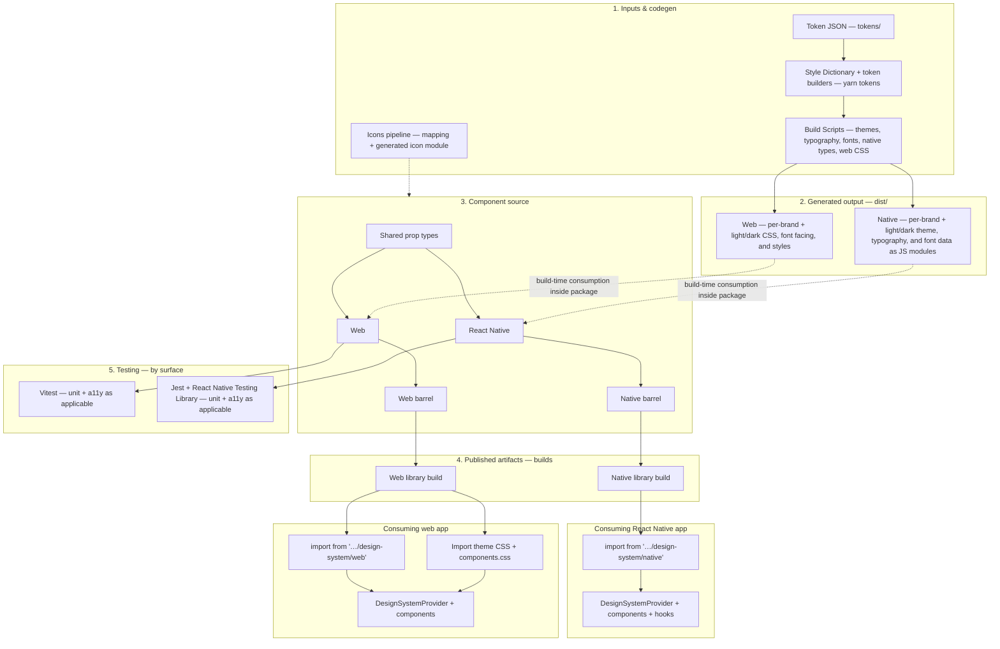

# Design system architecture — web & native (high level)

This document is for teams integrating **`@minneapolisstartribune/design-system`** who want a concise picture of how both platforms are built inside the package: shared tokens and codegen → generated `dist/` output → platform-specific components → what actually ships on npm for web vs React Native, and how we test. It stays high level and avoids listing every script or component.

## End-to-end flow

## How to read this as an integrator

| Layer             | What you should know                                                                                                                                                                                                                                                                                                                                        |
| ----------------- | ----------------------------------------------------------------------------------------------------------------------------------------------------------------------------------------------------------------------------------------------------------------------------------------------------------------------------------------------------------- |
| **Tokens → dist** | **Token JSON** is transformed by Style Dictionary and custom scripts into web CSS (themes, typography, font-face) and mobile JS modules (themes, typography, fonts, font-files will be provided separately). That is the shared “token truth”; apps typically do not import raw token files except where the integration guides show explicit CSS subpaths. |
| **Components**    | One shared type layer, two implementation trees (`web/` vs `native/*.native.tsx`), and separate barrels so each platform exports only what it supports.                                                                                                                                                                                                     |
| **Builds**        | **Web** is published as ESM + CJS with a preserve-modules-style layout under `dist/web`. **Native** is published as a single ES module\*\* bundle under `dist/mobile` plus typings.                                                                                                                                                                         |
| **Testing**       | **Vitest** exercises the web stack; **Jest + React Native Testing Library** exercises native files and native a11y suites.                                                                                                                                                                                                                                  |

## What ships on npm

Only the `dist/` tree is published (`files: ["dist"]` in the package). Integration is via `package.json` `exports`.

### Web

| Export / import shape                                                  | What you get                                                                                                                                                                                                                                                                                    |
| ---------------------------------------------------------------------- | ----------------------------------------------------------------------------------------------------------------------------------------------------------------------------------------------------------------------------------------------------------------------------------------------- | --- |
| **`@minneapolisstartribune/design-system/web`**                        | Main web entry: ESM and CJS bundles plus TypeScript types (`index.web.es.js`, `index.web.cjs.js`, `index.web.d.ts`). Components, `DesignSystemProvider`, icons, AnalyticsProvider, font helpers — see [`index.web.ts`](../packages/design-system/src/index.web.ts) for the full public surface. |
| **`@minneapolisstartribune/design-system/web/components.css`**         | **Aggregated component styles** — import alongside a theme file (see [Web integration](./web.md)).                                                                                                                                                                                              |
| **`@minneapolisstartribune/design-system/web/<path>`**                 | **Deep imports** into `dist/web/*` — e.g. **`startribune-light.css`**, **`varsity-dark.css`** (brand + scheme theme files).                                                                                                                                                                     |
| **`@minneapolisstartribune/design-system/web/fonts/font-face/<file>`** | **@font-face** CSS per brand.                                                                                                                                                                                                                                                                   |     |

### React Native

| Export / import shape                              | What you get                                                                                                                                                                                                                                                                                                                                                       |
| -------------------------------------------------- | ------------------------------------------------------------------------------------------------------------------------------------------------------------------------------------------------------------------------------------------------------------------------------------------------------------------------------------------------------------------ |
| **`@minneapolisstartribune/design-system/native`** | **Single ES module** (`design-system.es.js`) + `index.native.d.ts`. Curated components, `DesignSystemProvider`, and native hooks(`useNativeStyles`, `useNativeStylesWithDefaults`) — see [`index.native.ts`](../packages/design-system/src/index.native.ts). Token/theme data used by components is brought in through this build, not via separate theme imports. |

### Peers

Align React (and React DOM on web, React Native on native) and optional Floating UI packages with the design system’s peerDependencies — see [Web integration](./web.md) and [Mobile usage](./native.md).

## Related docs

- [Web integration](./web.md) — CSS entrypoints, `DesignSystemProvider`, peers
- [Mobile usage](./native.md) — native peers, provider, hooks
- [Troubleshooting](./troubleshooting.md) — web and mobile issues
